# #PFlowHeatmap Generator: Powered by CSRNet
>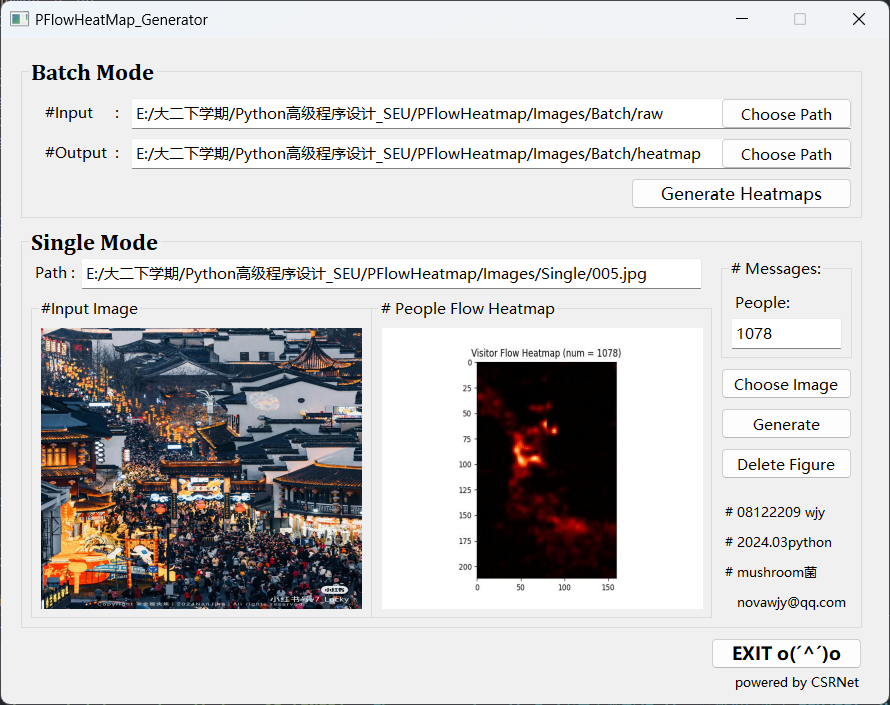</p>

Using CSRNet to estimate the crowd density and generate heatmaps for further process.
CSRNet: Dilated Convolutional Neural Networks for Understanding the Highly Congested Scenes [[Paper]](https://openaccess.thecvf.com/content_cvpr_2018/html/Li_CSRNet_Dilated_Convolutional_CVPR_2018_paper.html)


## Citation
If you find the code useful, please consider citing our paper using the following BibTeX entry.
```
@InProceedings{Li_2018_CVPR,
author = {Li, Yuhong and Zhang, Xiaofan and Chen, Deming},
title = {CSRNet: Dilated Convolutional Neural Networks for Understanding the Highly Congested Scenes},
booktitle = {Proceedings of the IEEE Conference on Computer Vision and Pattern Recognition (CVPR)},
month = {June},
year = {2018}
}
```

## Prerequisite
* Python 3.9, PyTorch 2.2.2, and more：

#### Creating conda environment
```
conda create -n CSR2024 python=3.9
conda activate CSR2024
```

#### Install python dependencies
```
pip3 install torch torchvision torchaudio --index-url https://download.pytorch.org/whl/cu118
pip install pyqt5
pip install pyqt5-tools
pip install numpy
pip install pandas
pip install scipy
pip install matplotlib
pip install image
pip install h5py
pip install sklearn
pip install scikit-learn
pip install opencv-python
pip install colorlog
```
#### Download ShanghaiTech dataset
* Follow instructions in [[ShanghaiTech Dataset]](https://paperswithcode.com/dataset/shanghaitech)

#### Train the model
* Follow instructions in [[Blog:基于卷积神经网络的密集人群估计/人群计数算法【内含教程和踩坑】]](https://blog.csdn.net/weixin_43594279/article/details/122413109)
* restore the weights matrix file:"PFlowHeatmap\ShanghaiTech\partA_model_best.pth.tar".

#### Run main.py to start the application and enjoy 
```
python main.py
```
## Function Details

### User Interface
Using PyQT5 and pyuic5 to generate the user interfaces.
Displaying figures through "label" widget because my unskilled using of QGraphicsView :monocle_face::hammer:
>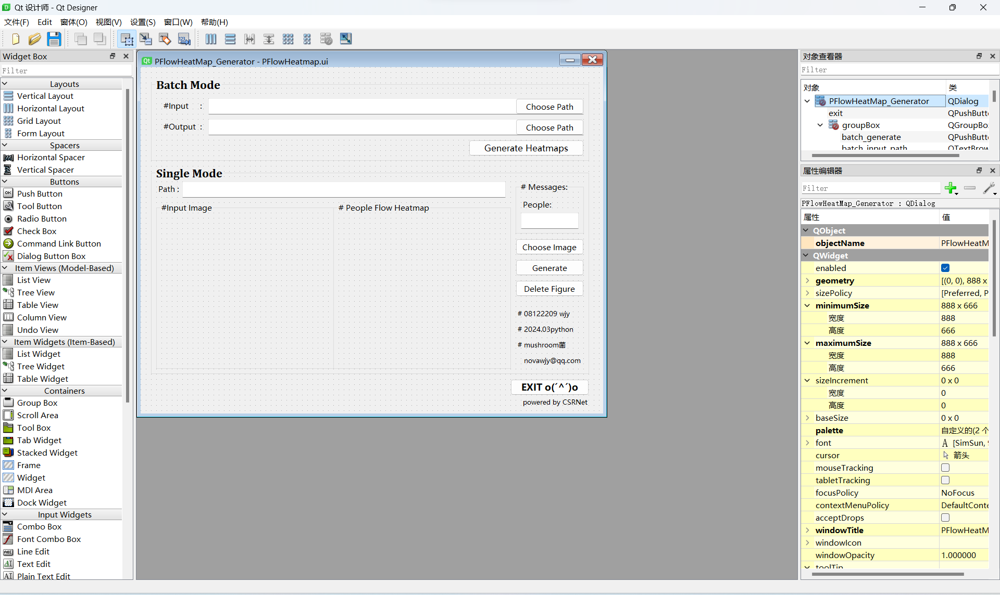</p>

### Log Recording
Using logging and colorlog to show the messages of the application.
>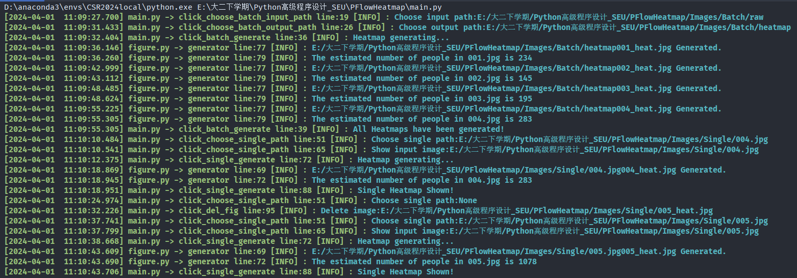</p>

### Heatmap Preview
Here are some previews of the results:white_check_mark:.
* Xuanwu Lake:
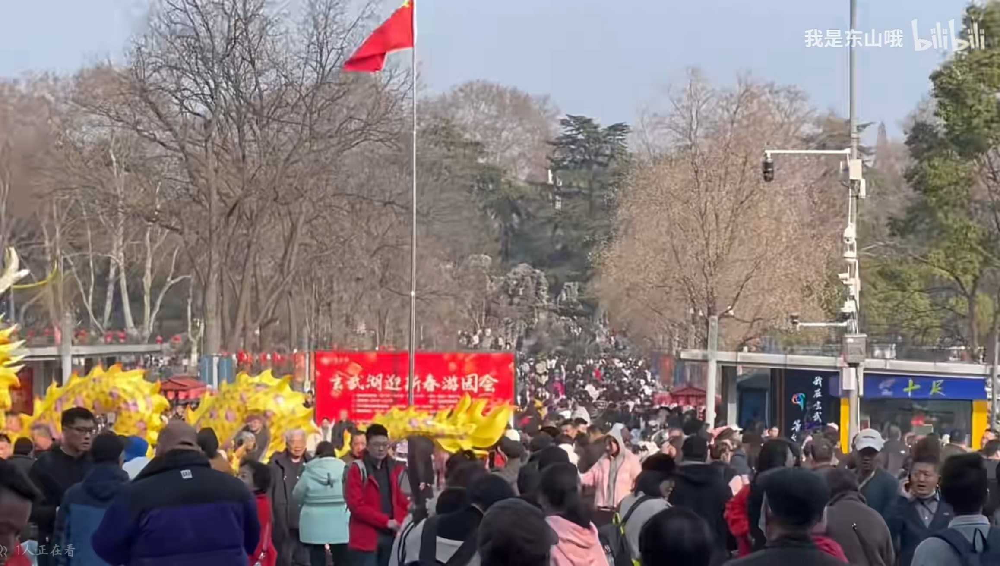</p>
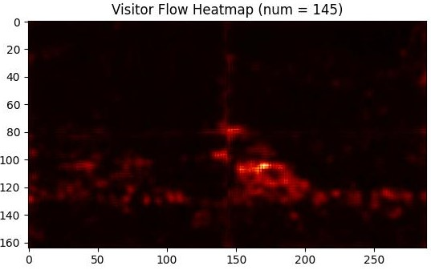</p>

* Mountain Tai:
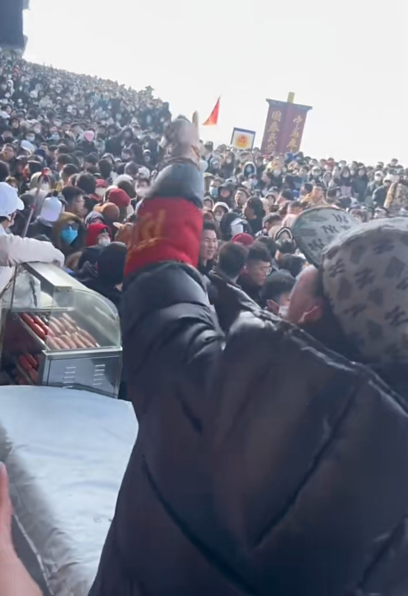</p>
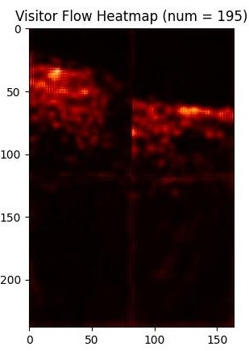</p>


* QinHuai River:
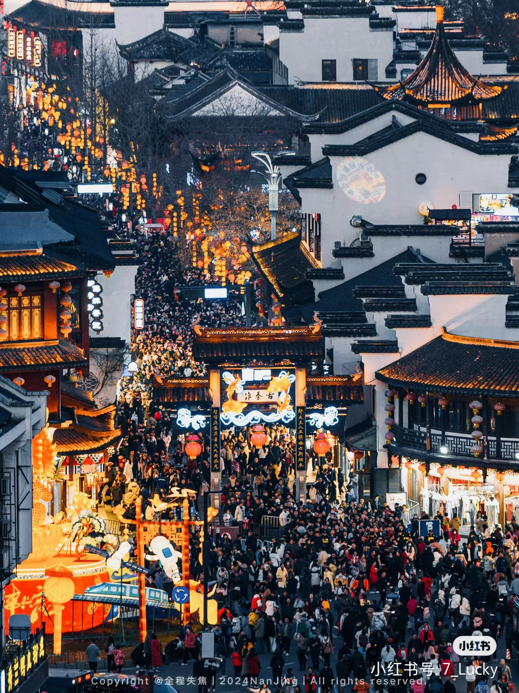</p>
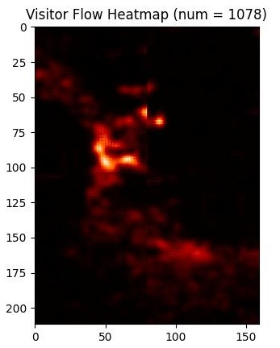</p>


* Deji Plaza:
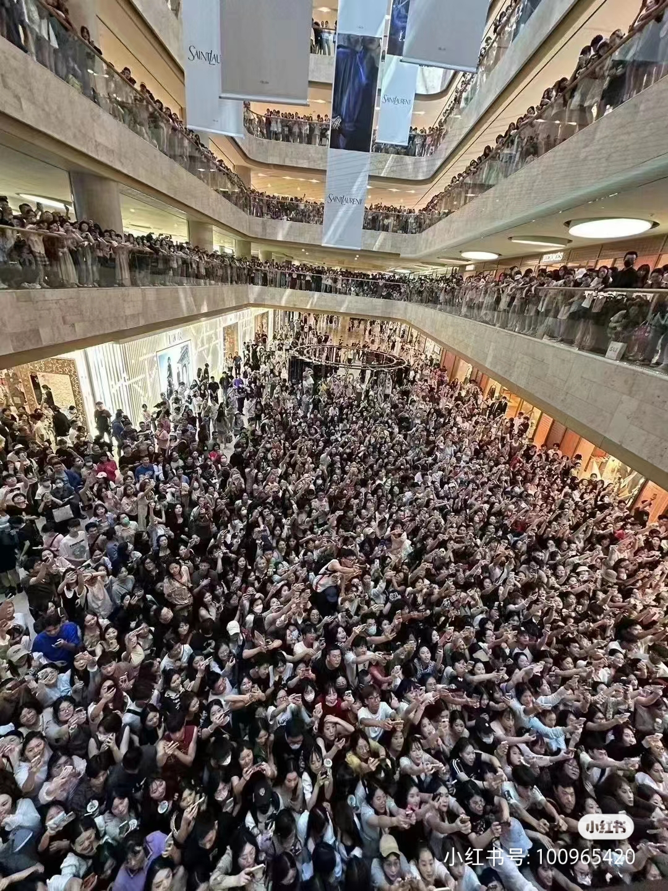</p>
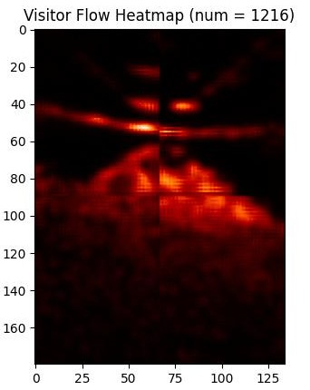</p>
